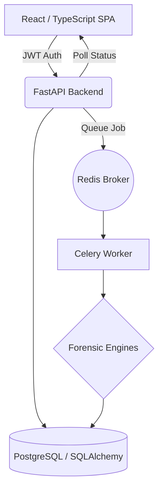
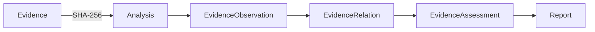

# ForenSight V3 — Digital Evidence Operating System

An explainable digital image forensic analysis and investigation operating system combining classical image processing, evidence provenance, asynchronous analysis workloads, deterministic cross-modality correlation, cryptographic chain of custody, and an interactive analyst review environment.

## 1. What is ForenSight?
ForenSight is an explainable digital image forensic investigation platform. Instead of relying on mathematically indefensible "fake/real" probabilistic outputs or black-box machine learning classifiers, ForenSight focuses on deterministic measurements, immutable provenance, and qualitative contextual assessments.

## 2. Engineering Highlights
ForenSight V3 demonstrates robust Software Engineering practices tailored for enterprise forensic operations:
- **Asynchronous Workloads**: Heavy computer vision tasks (Copy-Move, ELA, DCT) are executed off the main thread via a Redis/Celery worker architecture.
- **Evidence Provenance & Immutability**: Cryptographic SHA-256 fingerprinting at ingestion guarantees an immutable chain of custody verified by an automated Investigation Replay service and live tamper detection.
- **Batch Processing**: Multipart batch evidence ingestion with independent fault isolation, batch job queuing, and case-scoped progress monitoring.
- **Multi-Modality Forensic Heatmaps**: Explainable spatial anomaly candidate overlays mapping ELA, Noise, and Copy-Move on a standardized $[0.0, 1.0]$ coordinate grid without synthetic probability masks.
- **Side-by-Side Comparison**: Synchronized dual-canvas viewport comparing file metadata, dimensions, hash signatures, compression parameters, and modality artifacts.
- **Cross-Image Correlation**: Case-wide correlation evaluating shared camera hardware fingerprints (Make/Model/Serial), temporal capture sequencing, and cross-evidence descriptor matching.
- **Scientific Investigation Assistant**: Rule-based decision support synthesizing whole-case forensic status, highlighting missing modality analyses, and offering alternative benign technical explanations.
- **Investigation Knowledge Graph**: Directed acyclic topological graph linking `CASE -> EVIDENCE -> ANALYSIS_JOB -> ANALYSIS -> OBSERVATION -> FINDING -> REPORT`.
- **Storage & Tenant Isolation**: Evidence files are segregated using UUID-based storage isolation, preventing unauthorized cross-tenant access audited across all API endpoints.
- **Security & Authorization**: Implements strict Role-Based Access Control (RBAC) via JWT authentication and route-level dependency injection for case-level authorization.
- **Auditability**: An immutable, chronological audit trail automatically logs every meaningful investigative action.
- **Forensic Validation & Determinism**: Validated against a 15-fixture controlled forensic corpus with golden output regression snapshots and automated scientific freeze verification in CI.
- **Infrastructure**: Configured for reproducible containerized deployment via Docker Compose, validated by a GitHub Actions CI pipeline with 105 passing backend tests.

## 3. Architecture



**Evidence Lifecycle Provenance:**


## 4. Forensic Capabilities

| Module | Method | What it measures | Limitation |
|--------|--------|------------------|------------|
| **Metadata** | EXIF/App1 parsing | Extracts software signatures and capture hardware data. | Easily manipulated; absence does not prove authenticity. |
| **ELA** | Error Level Analysis | Measures absolute pixel difference upon JPEG recompression. | Proves recompression/processing history, not malicious intent. |
| **Noise** | High-Pass Filtering | Isolates high-frequency energy distributions. | Smooth patches may result from legitimate compression. |
| **JPEG/DCT** | 8x8 block quantization | Analyzes frequency statistics and quantization tables. | Multiple saves in authentic software will trigger anomalies. |
| **Copy-Move** | SIFT / RANSAC | Identifies candidate spatial correspondences and transformations. | Can flag legitimate repeated textures (e.g., brick walls). |

## 5. Async Job Architecture
Synchronous execution of SIFT, DCT, or Noise workloads blocks API workers, resulting in request timeouts and degraded performance. ForenSight resolves this by decoupling the analysis engines:
- FastAPI submits jobs to a Redis broker.
- Celery workers execute computationally expensive jobs in the background.
- Job states transition deterministically through: `QUEUED` → `RUNNING` → `COMPLETED` (or `FAILED`).
- The frontend asynchronously polls the Job API to update the UI without blocking the user workspace.

## 6. Authentication & Security
- **Authentication**: JWT tokens signed via `python-jose`, passwords hashed with `bcrypt` (pinned to 3.2.0 via `passlib`).
- **RBAC**: Administrative and investigator roles enforced at the endpoint layer.
- **Case Ownership**: Users are restricted to accessing only their authorized cases.
- **Upload Validation**: Strict MIME type verification, file format whitelists, and upload size limits.
- **Path Traversal Protection**: Explicit `pathlib.Path.relative_to` checks prevent breakouts. Absolute paths are suppressed in all API responses.
- **Secret Management**: Environment-based secret injection, mitigating hardcoded credentials.

## 7. Scientific Integrity
ForenSight prioritizes transparency. It explicitly rejects the premise that an image can be deterministically labeled "fake."
- ELA ≠ proof of manipulation.
- High residual ≠ manipulation.
- Copy-Move correspondence ≠ confirmed tampering.
- Assessment level ≠ probability.
- Missing analysis ≠ evidence of authenticity.

The platform treats ELA and JPEG/DCT as related compression evidence, preventing statistical double-counting of a single processing event.

## 8. Technology Stack
| Layer | Technology |
|---|---|
| **Frontend** | React / TypeScript / Vite / TailwindCSS |
| **Backend** | Python / FastAPI / Pydantic V2 |
| **Database** | PostgreSQL / SQLAlchemy / Alembic |
| **Task Queue** | Celery / Redis |
| **Forensics** | NumPy / OpenCV / Pillow |
| **Infrastructure**| Docker Compose / GitHub Actions CI |

## 9. Installation & Deployment

### Standard Installation (Docker Compose)
*Ensure Docker and Docker Compose are installed.*
```bash
git clone https://github.com/kharbashpriyanshu/ForenSight.git
cd ForenSight
docker-compose up -d --build
```
Access the platform at `http://localhost:5173`.

### Local Development Installation
*For environments without Docker:*
1. Setup Backend:
```bash
cd backend
python -m venv venv
venv\Scripts\activate  # Windows
pip install -r requirements.txt
python scripts/seed_demo.py
# By default, CELERY_TASK_ALWAYS_EAGER=true runs in eager fallback mode without Redis
uvicorn app.main:app --reload
```
2. Setup Frontend:
```bash
cd frontend
npm install
npm run dev
```

## 10. Documentation Index
- [V3 Baseline Specification & Freeze Manifest](FORENSIGHT_V3_BASELINE.md)
- [Amped Authenticate Capability Parity Matrix](FORENSIGHT_AMPED_PARITY_MATRIX.md)
- [Architecture & Trust Boundaries](docs/architecture.md)
- [Deployment Guide (Local & Docker Compose)](docs/DEPLOYMENT.md)
- [CI/CD Pipeline Specification](docs/CI_CD.md)
- [Security Architecture & RBAC Policy](docs/SECURITY.md)
- [Demonstration Workflow Script](docs/demo-workflow.md)
- [Technical Master Reference](docs/FORENSIGHT_TECHNICAL_MASTER.md)

## 11. Testing & Verification Summary
The system is validated via comprehensive automated test suites and static analysis:
- **Backend Tests:** 105 Passing, 0 Failed, 0 Skipped across 23 test modules (including multi-user security, JWT auth, RBAC isolation, async job lifecycle, cross-image correlation, investigation graph, live tamper detection, and adversarial QA).
- **TypeScript:** 0 Errors (`tsc -b`)
- **Frontend Production Build:** PASS (`npm run build`, built in 7.26s)
- **Scientific Freeze:** 100% Preserved (all 38 source files in `backend/app/forensics/` match cryptographic freeze manifest).
- **V3 Baseline Status:** BASELINE VERIFIED & FROZEN.
- **Next Phase:** V4 Advanced Image Forensics (V4 is NOT started).

## 12. Screenshots
Detailed interface screenshots are available in the [docs/screenshots](docs/screenshots) directory.
