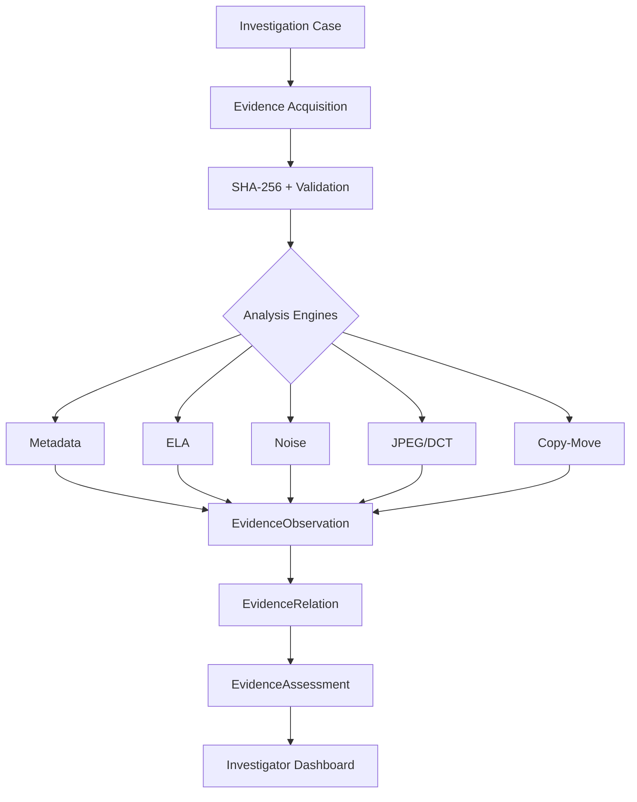

# ForenSight V2.0

An explainable digital image forensic analysis platform combining classical image processing, computer vision, evidence provenance, and deterministic cross-modality correlation.

## 1. Project Overview
ForenSight V2.0 is a modular digital image forensics platform designed to execute multi-modality analysis to uncover traces of tampering and processing history. It features an async job architecture (Celery/Redis), proper case isolation (RBAC), and a dynamic React Router-driven workspace.

## Links
- [Demo Workflow](docs/demo-workflow.md)
- [Screenshots Checklist](docs/screenshots-checklist.md)
- [Technical Master Document](docs/FORENSIGHT_TECHNICAL_MASTER.md)

## 2. Why ForenSight?
In an era of rampant digital manipulation, determining the authenticity of an image is increasingly difficult. Visual forensics and image manipulation detection are crucial for legal proceedings, journalism, and insurance claims. ForenSight addresses this by focusing on deterministic measurements and qualitative contextual assessments rather than mathematically indefensible "fake/real" probability scores.

## 3. Core Capabilities

- **Metadata / EXIF:** Extracts software signatures and EXIF tags. Useful for context, but limited because metadata is trivially stripped or forged.
- **ELA (Error Level Analysis):** Measures absolute pixel difference upon JPEG recompression. Useful for detecting processing history, but limited because high error does not independently prove manipulation.
- **Noise Residual Analysis:** Uses Gaussian low-pass filtering to isolate high-frequency anomalies. Useful for detecting spliced regions, but limited because heavy textures naturally mimic noise.
- **JPEG/DCT:** Analyzes 8x8 block quantization tables and frequency statistics. Useful for detecting double-compression, but limited to JPEG images.
- **Copy-Move Detection:** Uses SIFT, Lowe's ratio, and RANSAC geometric verification. Useful for finding internal cloned regions, but limited by naturally repeating structures.
- **Evidence Normalization:** Converts raw mathematical outputs into standardized observations.
- **Evidence Correlation:** Prevents double-counting of related phenomena (e.g., ELA and DCT).
- **Explainable Assessment:** Emits a final qualitative concern level based on deterministic rules.

## 4. How It Works

1. Investigators upload digital evidence into an isolated Case workspace.
2. An immutable SHA-256 fingerprint establishes a verifiable chain of custody.
3. Users execute specific forensic modules (Metadata, ELA, Noise, DCT, Copy-Move).
4. Raw measurements are normalized into canonical observations.
5. A deterministic Fusion Rule Engine evaluates observations and outputs an explainable qualitative assessment.

## 5. Architecture



## 6. Forensic Analysis Modules

- **ELA:** Original JPEG &rarr; Controlled recompression &rarr; Pixel difference &rarr; Normalized error map
- **Noise:** Image &rarr; Gaussian low-pass estimate &rarr; Residual &rarr; Global/local residual maps
- **JPEG/DCT:** JPEG &rarr; 8×8 blocks &rarr; DCT &rarr; Quantization analysis &rarr; Frequency statistics
- **Copy-Move:** Image &rarr; SIFT &rarr; Descriptors &rarr; BFMatcher &rarr; Lowe ratio test &rarr; Spatial filtering &rarr; RANSAC &rarr; Candidate correspondences
- **Metadata:** Image &rarr; EXIF/XMP/software metadata &rarr; Structured observations

## 7. Evidence Fusion
ForenSight aggregates canonical observations from the analysis modules into Evidence Families (Compression, Residual, Spatial Correspondence, File Context). Observations are contextually related, preventing double-counting. For example, ELA and JPEG/DCT both measure 8x8 block macro-compression and are categorized under the same Contextual Family. The Rule Engine (7B-v1) generates the final qualitative assessment based on these grouped indicators.

## 8. Security & Evidence Integrity

- **Upload size limits:** Enforced by FastAPI settings (`MAX_UPLOAD_SIZE`).
- **Image validation:** Strict `Pillow` decoding prevents buffer-overflows and corrupt payloads.
- **MIME/extension validation:** Checked at the endpoint boundary.
- **Filename sanitization:** Original filenames are discarded.
- **UUID storage:** Physical storage uses 128-bit UUIDs to prevent enumeration.
- **SHA-256 baseline:** The original SHA-256 establishes a baseline fingerprint for the acquired evidence. Recomputing the hash later and comparing it with the stored value can detect subsequent byte-level changes.
- **Source/artifact separation:** Immutable evidence is physically segregated from disposable artifacts.
- **Artifact traversal protection:** Explicit `pathlib.Path.relative_to` checks prevent any breakout.
- **Absolute path suppression:** Standard errors do not leak internal system structures.
- **CORS configuration:** Managed via `BACKEND_CORS_ORIGINS`.
- **Security headers:** `X-Content-Type-Options: nosniff`, `X-Frame-Options: DENY`, `X-XSS-Protection: 1; mode=block`.
- **Environment configuration:** Sensitive deployment variables live in `.env`.
- **Safe errors:** Failures in processing correctly return 400 or 500 without crashing the server.

## 9. Technology Stack

| Layer | Technology | Purpose |
|---|---|---|
| **Backend** | Python / FastAPI | Asynchronous REST API, routing, and security middleware |
| **Validation** | Pydantic | Strict input/output JSON schema enforcement |
| **Database** | SQLite / SQLAlchemy | Local ORM persistence of Cases, Evidence, and Analyses |
| **Forensics** | NumPy / OpenCV / Pillow | High-speed tensor operations (einsum), filtering, and SIFT |
| **Frontend** | React / TypeScript / Vite | Typed, reactive, high-performance UI Dashboard |

## 10. Project Structure

```text
ForenSight/
├── backend/
│   ├── app/
│   │   ├── api/          # FastAPI Routes (cases, evidence, artifacts)
│   │   ├── core/         # Configuration & Settings
│   │   ├── db/           # SQLite & SQLAlchemy engine
│   │   ├── forensics/    # ELA, Noise, DCT, Copy-Move, Fusion Rules
│   │   ├── models/       # Database schemas
│   │   └── schemas/      # Pydantic schemas
│   ├── storage/          # Isolated physical storage (evidence & artifacts)
│   ├── tests/            # Integration and mathematical test suite
│   └── main.py           # Application Entrypoint
├── frontend/
│   ├── src/
│   │   ├── components/   # React Components
│   │   └── pages/        # Dashboard view
│   └── package.json      # Dependencies
└── docs/                 # Technical documentation
```

## 11. Installation

### Environment Configuration
1. Clone the repository.
2. In the `backend` folder, duplicate `.env.example` as `.env`.
3. Configure `BACKEND_CORS_ORIGINS` and `STORAGE_DIR` accordingly.

### Backend Setup
```bash
cd backend
python -m venv venv
# On Windows: venv\Scripts\activate
# On Linux/Mac: source venv/bin/activate
pip install -r requirements.txt
```
*Note: SQLite database initializes automatically on first boot.*

### Frontend Setup
```bash
cd frontend
npm install
npm run build
```

## 12. Running the Application

### Running Backend
```bash
cd backend
# With activated virtual environment
uvicorn app.main:app --reload
```

### Running Frontend
```bash
cd frontend
npm run dev
```

## 13. API Overview

| Method | Endpoint | Purpose |
|---|---|---|
| GET | `/api/health` | Application heartbeat and status |
| GET / POST | `/api/cases` | Fetch or create an investigation case |
| POST | `/api/cases/{case_id}/evidence` | Securely acquire and hash digital evidence |
| POST | `/api/evidence/{evidence_id}/analysis/{modality}` | Trigger a forensic algorithm (e.g., ela, noise, jpeg-dct, copy-move) |
| GET | `/api/artifacts/{artifact_path:path}` | Securely serve a generated visual heatmap or artifact |
| POST | `/api/evidence/{evidence_id}/fusion/assess` | Execute the deterministic rule engine (7B-v1) |

## 14. Testing
**Current Baseline:** 49 tests, 49 passed, 0 failed.

ForenSight relies on `pytest` and `fastapi.testclient.TestClient`. Testing categories include:
- **Unit:** Validating isolated logic and schema serialization.
- **Integration:** Testing entire upload-to-analysis pipelines.
- **Mathematical:** Validating NumPy/OpenCV outputs against expectations.
- **API:** Correct HTTP error propagations.
- **Security:** Actively trying to exploit path traversal endpoints.
- **Source integrity:** Asserting that SHA-256 bytes remain unaltered post-analysis.

## 15. Scientific Limitations
ForenSight does NOT automatically determine whether an image is fake. It does NOT produce a fake percentage, authenticity percentage, manipulation probability, or a definitive tampering verdict.

Instead, Measurements &rarr; Observations &rarr; Contextual relationships &rarr; Evidence families &rarr; Qualitative forensic assessment.

Assessment levels represent the *degree of further forensic investigation warranted* by available observations. Artifacts (e.g., ELA and DCT traces) often highlight standard software processing history, resizing, or native camera processing, rather than explicit forgery. Missing modalities (e.g., no Metadata) do not imply authenticity.

## 16. Screenshots / Demo
Demo screenshots will be added before the public release.

## 17. Documentation
- [Technical Master Guide](docs/FORENSIGHT_TECHNICAL_MASTER.md)
- [Architecture](docs/architecture.md)
- [Forensic Methodology](docs/forensics)
- [Evidence Fusion](docs/FORENSIGHT_TECHNICAL_MASTER.md)
- [Development Logs](docs/development-log)
- [Release Checklist](docs/release-checklist-v1.0.md)

## 18. Roadmap
*Future Engineering Work (Not currently implemented):*
- Asynchronous analysis workers for non-blocking processing
- PostgreSQL deployment migration
- Improved artifact lifecycle management
- Authentication and authorization layers
- Scalable cloud deployment models
- Additional forensic modules

## 19. License
No license is currently assigned.
