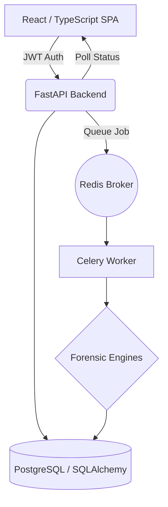
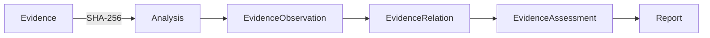

# ForenSight — Image Forensics Investigation Platform

ForenSight is an explainable digital image-forensics investigation platform for teams reviewing images received through forwarding, compression, cropping, screenshotting, or web downloads. It preserves the received file, records the reported claim and acquisition context, links reviewable image-version candidates, and supports analyst-led reporting alongside classical image analysis.

It is intentionally focused on **digital image evidence**; it is not a disk-imaging, mobile-device, video, or generative-AI detection suite. Measurements and candidate anomalies are investigative signals, not proof of manipulation or authenticity.

## Capabilities
- **Asynchronous Workloads**: Heavy computer vision tasks (Copy-Move, ELA, DCT) are executed off the main thread via a Redis/Celery worker architecture.
- **Evidence Provenance**: SHA-256 fingerprinting at ingestion, chain-of-custody records, replay verification, and tamper checks.
- **Claim-First Intake**: Record the reported claim, event date/location, source reference, how each file was received, and reported capture time separately from engine observations.
- **Image Version Lineage**: Find exact file duplicates and likely visual derivatives across crops, recompression, resizing, and screenshots. Every relation is a candidate until an analyst reviews it and sets direction.
- **Batch Processing**: Multipart batch evidence ingestion with independent fault isolation, batch job queuing, and case-scoped progress monitoring.
- **Image Examination**: Metadata, ELA, noise, JPEG structure/compression, copy-move, resampling, color/frequency analysis, and PRNU-related tooling. Applicability depends on the input and method.
- **Multi-Modality Heatmaps**: Spatial anomaly candidate overlays without synthetic probability masks.
- **Side-by-Side Comparison**: Synchronized dual-canvas viewport comparing file metadata, dimensions, hash signatures, compression parameters, and modality artifacts.
- **Cross-Image Correlation**: Case-wide correlation evaluating shared camera hardware fingerprints (Make/Model/Serial), temporal capture sequencing, and cross-evidence descriptor matching.
- **Investigation Assistant**: Rule-based decision support highlighting missing analyses and possible benign explanations; it is not an AI/ML classifier.
- **Content Credentials**: Optional C2PA manifest inspection with remote retrieval disabled. Credential absence is not evidence of manipulation, and valid provenance does not prove a depicted event is true.
- **Investigation Knowledge Graph**: Directed acyclic topological graph linking `CASE -> EVIDENCE -> ANALYSIS_JOB -> ANALYSIS -> OBSERVATION -> FINDING -> REPORT`.
- **Benchmarking**: Controlled fixtures, dataset manifests and integrity checks, per-engine evaluation reports, reproducibility checks, and external-dataset benchmark workflows.
- **Transformation Stress Runs**: Compare baseline engine measurements with reproducible forwarding, recompression, crop, screen-recapture, and metadata-stripping simulations. These laboratory profiles are not named-platform accuracy claims.
- **Security & Authorization**: JWT authentication, role checks, case-scoped access, upload validation, and UUID-based evidence storage.
- **Auditability**: An immutable, chronological audit trail automatically logs every meaningful investigative action.
- **CI**: GitHub Actions workflows cover backend tests, scientific-core freeze verification, frontend type/build checks, Docker build/config validation, and PostgreSQL/Redis integration.

## Current Validation Snapshot

The checked-in controlled benchmark report at [`backend/datasets/benchmark/benchmark_report.md`](backend/datasets/benchmark/benchmark_report.md) records **11 images and 22 evaluations across ADVANCED-NOISE and RESAMPLING**. It verifies three-run determinism and reports runtime and execution status. That artifact does **not** include localization metrics, and it is not evidence of broad real-world accuracy. The separate transformation stress endpoint measures engine behavior under synthetic benign processing profiles; it does not claim named-platform false-alarm or accuracy rates.

External-dataset benchmarking is implemented as a workflow, but real external data must be separately obtained, licensed, registered, and evaluated. The repository includes protocols and adapters; it does not include the CASIA, Columbia, or NIST OpenMFC image collections. Do not interpret synthetic/controlled fixture performance as field performance.

## Architecture


```mermaid
graph TD
    UI[React / TypeScript SPA] -->|JWT Auth| API(FastAPI Backend)
    API --> DB[(PostgreSQL / SQLAlchemy)]
    API --> |Queue Job| Redis((Redis Broker))
    Redis --> Worker[Celery Worker]
    Worker --> Engines{Forensic Engines}
    Engines --> DB
    API --> |Poll Status| UI
```

**Evidence Lifecycle Provenance:**

```mermaid
graph LR
    Evidence --> |SHA-256| Analysis
    Analysis --> EvidenceObservation
    EvidenceObservation --> EvidenceRelation
    EvidenceRelation --> EvidenceAssessment
    EvidenceAssessment --> Report
```

## Forensic Methods & Limitations

| Module | Method | What it measures | Limitation |
|--------|--------|------------------|------------|
| **Metadata** | EXIF/App1 parsing | Extracts software signatures and capture hardware data. | Easily manipulated; absence does not prove authenticity. |
| **ELA** | Error Level Analysis | Measures absolute pixel difference upon JPEG recompression. | Proves recompression/processing history, not malicious intent. |
| **Noise** | High-Pass Filtering | Isolates high-frequency energy distributions. | Smooth patches may result from legitimate compression. |
| **JPEG/DCT** | 8x8 block quantization | Analyzes frequency statistics and quantization tables. | Multiple saves in authentic software will trigger anomalies. |
| **Copy-Move** | SIFT / RANSAC | Identifies candidate spatial correspondences and transformations. | Can flag legitimate repeated textures (e.g., brick walls). |

## Analysis Jobs
Synchronous execution of SIFT, DCT, or Noise workloads blocks API workers, resulting in request timeouts and degraded performance. ForenSight resolves this by decoupling the analysis engines:
- FastAPI submits jobs to a Redis broker.
- Celery workers execute computationally expensive jobs in the background.
- Job states transition deterministically through: `QUEUED` → `RUNNING` → `COMPLETED` (or `FAILED`).
- The frontend asynchronously polls the Job API to update the UI without blocking the user workspace.

## Authentication & Security
- **Authentication**: JWT tokens signed via `python-jose`, passwords hashed with `bcrypt` (pinned to 3.2.0 via `passlib`).
- **RBAC**: Administrative and investigator roles enforced at the endpoint layer.
- **Case Ownership**: Users are restricted to accessing only their authorized cases.
- **Upload Validation**: Strict MIME type verification, file format whitelists, and upload size limits.
- **Path Traversal Protection**: Explicit `pathlib.Path.relative_to` checks prevent breakouts. Absolute paths are suppressed in all API responses.
- **Secret Management**: Environment-based secret injection, mitigating hardcoded credentials.

## Scientific Interpretation
ForenSight prioritizes transparency. It explicitly rejects the premise that an image can be deterministically labeled "fake."
- ELA ≠ proof of manipulation.
- High residual ≠ manipulation.
- Copy-Move correspondence ≠ confirmed tampering.
- Assessment level ≠ probability.
- Missing analysis ≠ evidence of authenticity.

The platform treats ELA and JPEG/DCT as related compression evidence, preventing statistical double-counting of a single processing event.

## Technology Stack
| Layer | Technology |
|---|---|
| **Frontend** | React / TypeScript / Vite / CSS |
| **Backend** | Python / FastAPI / Pydantic V2 |
| **Database** | PostgreSQL / SQLAlchemy / Alembic |
| **Task Queue** | Celery / Redis |
| **Forensics** | NumPy / OpenCV / Pillow |
| **Infrastructure**| Docker Compose / GitHub Actions CI |

## Run Locally

### Standard Installation (Docker Compose)
*Ensure Docker and Docker Compose are installed.*
```bash
git clone https://github.com/kharbashpriyanshu/ForenSight.git
cd ForenSight
cp .env.example .env
# Set a strong SECRET_KEY in .env before using this outside a local demo.
docker compose up -d --build
```
Access the containerized platform at `http://localhost` (port 80). Local Vite development uses `http://localhost:5173`.

### Local Development Installation
*For environments without Docker:*
1. Setup Backend:
```bash
cd backend
python -m venv venv
venv\Scripts\activate  # Windows
pip install -r requirements.txt
python scripts/seed_demo.py
# By default, CELERY_TASK_ALWAYS_EAGER=true runs in eager fallback mode without Redis
uvicorn app.main:app --reload
```
2. Setup Frontend:
```bash
cd frontend
npm install
npm run dev
```

## Documentation
- [V3 Baseline Specification & Freeze Manifest](FORENSIGHT_V3_BASELINE.md) (describes the frozen V3 core, not the complete current product)
- [Amped Authenticate Capability Parity Matrix](FORENSIGHT_AMPED_PARITY_MATRIX.md)
- [Architecture & Trust Boundaries](docs/architecture.md)
- [Forwarded Image Investigation Workflow](docs/IMAGE_LINEAGE_WORKFLOW.md)
- [Deployment Guide (Local & Docker Compose)](docs/DEPLOYMENT.md)
- [CI/CD Pipeline Specification](docs/CI_CD.md)
- [Security Architecture & RBAC Policy](docs/SECURITY.md)
- [Demonstration Workflow Script](docs/demo-workflow.md)
- [Technical Master Reference](docs/FORENSIGHT_TECHNICAL_MASTER.md)
- [Benchmark Harness Guide](docs/FORENSIGHT_BENCHMARKING.md)
- [External Benchmark Protocol](docs/EXTERNAL_BENCHMARK_PROTOCOL.md)
- [Forensic Validation Framework](docs/FORENSIC_VALIDATION.md)

## Tests

Run backend tests from `backend/`:

```bash
pytest tests/ -v
```

Run frontend checks from `frontend/`:

```bash
npm ci
npm run build
```

The CI workflow additionally verifies the frozen V3 core and exercises Docker and PostgreSQL/Redis paths. See [`.github/workflows/ci.yml`](.github/workflows/ci.yml) for the authoritative current commands. Test totals may change; use the latest CI run rather than a hard-coded count.

## Screenshots

Interface screenshots and capture status are listed in [`docs/screenshots`](docs/screenshots).
